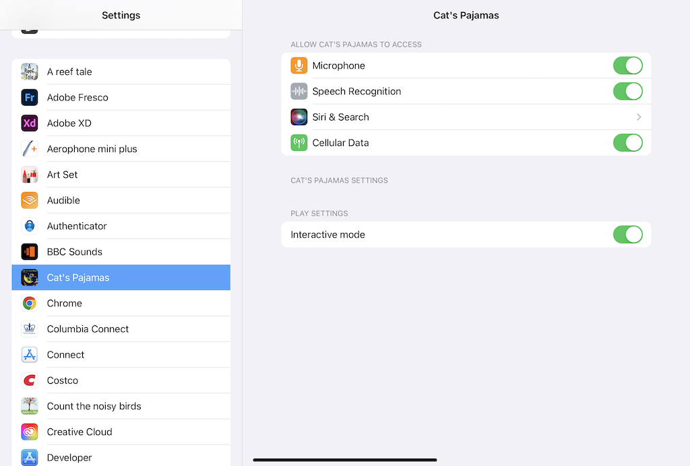

Quick Start
===========

Pajama Cats Media is developing voice recognition-based interactive children’s literature. Children develop language vocabulary through Interaction with others. The two major factors that impact a child's language development are the total amount of speech exposed to the child and the amount of contingent Interaction. Contingent interaction consists of a dialog between the child and another person that depends on the ability of the child to communicate effectively. Pajama Cats Media uses artificial intelligence to  simulate contingent interaction in the use of interactive children's books. The interaction consists of a dialog between the child and the book that responds based on the child's ability to communicate effectively about the contents of the book.  The system is designed to improve early language development by providing user-specific, reinforcing interaction to the child while reading.

## Install our book 

You can simply download our books as apps from Apple App Store. If you are using volume purchasing, please contact your school's IT department on how to install. 

## Use our book

Our books by default is "interactive" mode, which acts like other voice assistant on mobile devices. Once kids are ready to talk, the system will show a button, press and hold it to start talking, release the button to finish talking and start to recognize and understand what they were saying. 

For younger kids or someone who have difficuty to press the botton, we also have "play" mode, which will automatic trigger the listening status. You can open the setting of the book, and disable "interacitve" to use this mode

